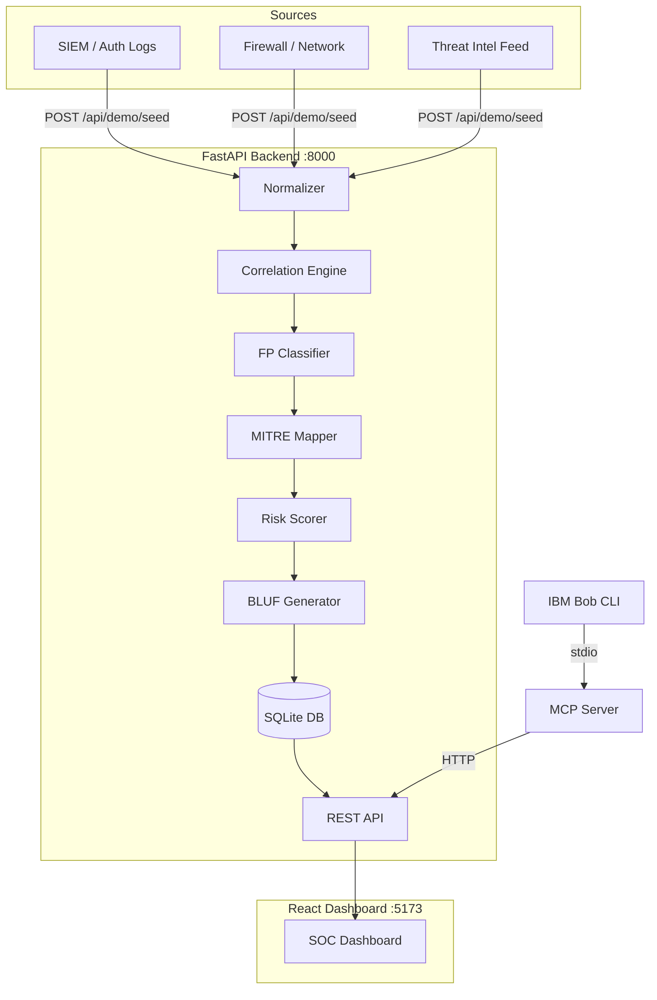

# 🔍 ThreatLens

> Threat Intelligence Correlation & Alert Prioritisation Assistant

---

## 👥 Team

| Field | Value |
|---|---|
| **Team Name** | Threat Minds |
| **Track** | AI |
| **Team Lead** | Tamanna Bhura |
| **Members** | Keshvi Vishal Kapadia, Ashvi Antala, Niksha Garnara |

---

## 🎯 Problem Statement

Security Operations Centre (SOC) analysts are overwhelmed by thousands of raw alerts per day from SIEM systems, firewalls, and threat intelligence feeds. These alerts arrive in different formats, mostly unrelated on the surface, and require hours of manual investigation to determine which represent genuine threats. Alert fatigue causes real attacks to be missed while analysts waste time on false positives.

---

## 💡 Solution

ThreatLens ingests raw security alerts from multiple sources (SIEM, firewall, threat intelligence), normalises them to a common schema, and automatically correlates related alerts into incidents using source IP, indicator overlap, and time-window analysis. Each incident receives a transparent 0–100 risk score, MITRE ATT&CK technique mapping, false-positive classification, and a commander-level BLUF summary — all without external APIs or cloud dependencies. IBM Bob integrates via MCP to let analysts query incidents in natural language.

---

## ✨ Key Features

- **Multi-source ingestion & normalisation:** Accepts alerts from SIEM, firewall, and threat-intel feeds; normalises to a common event schema
- **Deterministic correlation engine:** Groups related alerts into incidents using source IP, indicators, and 10-minute time windows (union-find algorithm)
- **Transparent risk scoring:** 0–100 risk score with explainable breakdown — severity, volume, threat-intel match, MITRE coverage, FP penalty
- **MITRE ATT&CK mapping:** Automatically maps alert patterns to T1110, T1046, T1078, T1098, T1059, T1059.001, T1074, and more
- **BLUF generation:** Commander-level Bottom Line Up Front summaries with evidence, techniques, risk, and recommended actions
- **IBM Bob / MCP integration:** Five MCP tools let Bob query incidents, investigate details, retrieve MITRE mappings, and generate BLUFs in natural language

---

## 🏗️ Architecture



---

## 🤖 IBM Bob Integration

ThreatLens includes a dedicated MCP server (`src/mcp_server/server.py`) that exposes five tools to IBM Bob:

| Tool | Description |
|---|---|
| `get_priority_incidents` | List highest-risk incidents ordered by score |
| `get_incident` | Full detail for a specific incident |
| `investigate_incident` | Structured investigation: IPs, timeline, risk breakdown |
| `get_mitre_mapping` | MITRE ATT&CK techniques for an incident |
| `generate_bluf` | Commander-level BLUF summary |

**Bob configuration** (`.bob/mcp.json`):
```json
{
  "mcpServers": {
    "threatlens": {
      "command": "python",
      "args": ["src/mcp_server/server.py"],
      "cwd": "."
    }
  }
}
```

**Example Bob queries:**
- *"What is the most dangerous incident right now?"*
- *"Investigate incident 1"*
- *"Give me a commander-level BLUF for the critical incident"*

---

## 🛠️ Tech Stack

| Category | Technologies |
|---|---|
| **Languages** | Python 3.13, JavaScript (ES2022) |
| **Backend** | FastAPI 0.115, uvicorn, aiosqlite |
| **Frontend** | React 19, Vite 8 |
| **Database** | SQLite (aiosqlite async) |
| **IBM Technologies** | IBM Bob (MCP integration) |
| **Data** | Pandas, Pydantic v2 |
| **Other** | MCP SDK, union-find correlation, MITRE ATT&CK local dataset |

---

## ⚡ How to Run

### Backend

```cmd
cd src\backend
python -m venv .venv
.venv\Scripts\activate
pip install -r requirements.txt
uvicorn main:app --reload --port 8000
```

### Frontend

```cmd
cd src\frontend
npm install
npm run dev
```

### Load Demo Data

Open `http://localhost:5173` and click **⚡ Load Demo Data**.

Or via API:
```cmd
curl -X POST http://localhost:8000/api/demo/seed
```

---

## 🖥️ Demo

| Artifact | Link |
|---|---|
| 📹 Demo Video Round 1| [See demo/demo-video-link.txt](demo/demo-video-link.txt)|
| 📹 Demo Video Round 2| [See demo/final-demo-url.txt](demo/final-demo-url.txt) |
| 🌐 Live Demo | [See demo/live-demo-url.txt](demo/live-demo-url.txt) |
| 🖼️ Screenshots | [See demo/screenshots/](demo/screenshots/) |

---

## ⚠️ Known Limitations

- Demo data is simulated — not connected to real SIEM/firewall feeds
- Threat intelligence list is a small hardcoded set matching the demo scenario
- MCP server requires the backend to be running on localhost:8000
- No authentication — intended as a hackathon prototype
- Frontend tested on Chrome/Edge; mobile layout not optimised

---

## 🏅 What We're Most Proud Of

The **correlation engine + explainable risk scoring pipeline** — 25 raw alerts from three different sources automatically collapse into 8 meaningful incidents with transparent, human-readable scoring breakdowns. The CRITICAL incident (185.22.14.8 → 10.0.0.15) achieves risk 95/100 with 100% confidence by correlating threat-intel, port scan, brute-force, and privilege escalation evidence into a single incident that a human analyst would immediately act on. Every score factor is shown in the UI so analysts understand exactly why something is high-risk.
