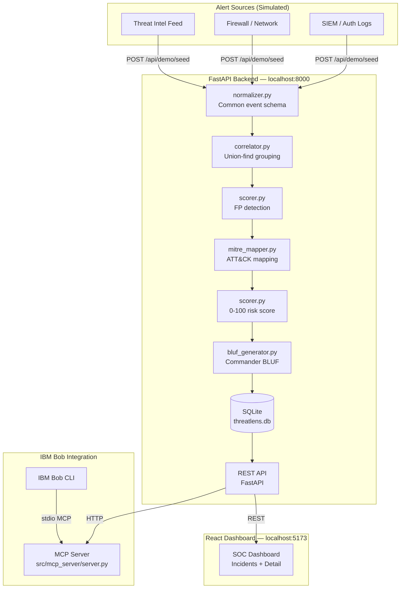

# Architecture

## System Architecture



## Components

| Component | Technology | Responsibility |
|---|---|---|
| Normalizer | Python | Converts raw alerts from any source format to common 8-field schema |
| Correlation Engine | Python (union-find) | Groups alerts into incidents by IP, indicator, and time window |
| Scorer | Python | Computes 0–100 risk score with 5 transparent weighted factors |
| MITRE Mapper | Python (keyword table) | Maps alert patterns to ATT&CK technique IDs |
| BLUF Generator | Python (template) | Produces commander-level Bottom Line Up Front summaries |
| SQLite Database | aiosqlite | Stores normalised alerts and enriched incidents |
| REST API | FastAPI + uvicorn | Serves incidents, alerts, and demo seed endpoints |
| React Dashboard | React 19 + Vite 8 | SOC dashboard with incident table and detail panels |
| MCP Server | MCP SDK (stdio) | Exposes 5 tools for IBM Bob natural-language queries |

## Data Flow

1. `POST /api/demo/seed` triggers ingestion of 25 demo alerts
2. Each alert is normalised to `{timestamp, source, src_ip, dst_ip, event_type, severity, confidence, indicator}`
3. The correlation engine groups all 25 alerts into 8 incident clusters using union-find
4. Each cluster is scored (risk + confidence), MITRE-mapped, and BLUF-generated
5. Results are persisted to SQLite
6. `GET /api/incidents` returns incidents ordered by risk score descending
7. `GET /api/incidents/{id}` returns full detail including all correlated alerts
8. React dashboard fetches from the REST API and renders the SOC view
9. IBM Bob calls MCP tools which proxy to the same REST API

## Risk Scoring Formula

```
risk_score = severity_score (0-40)
           + volume_score   (0-20)
           + ti_score       (0-25)
           + mitre_score    (0-10)
           - fp_penalty     (0-30)
```

| Factor | Source | Max Points |
|---|---|---|
| Severity score | Highest severity in alert group | 40 |
| Volume score | Number of correlated alerts × 3 | 20 |
| Threat intel score | IP in known-malicious list | 25 |
| MITRE score | Number of matched techniques × 2.5 | 10 |
| FP penalty | All IPs are known scanners OR all alerts low+low-conf | −30 |

Priority bands: CRITICAL ≥ 90 · HIGH ≥ 70 · MEDIUM ≥ 40 · LOW < 40

## Security Considerations

- API keys and secrets stored in `.env` (never committed — in `.gitignore`)
- SQLite database file excluded from version control via `.gitignore`
- No authentication in prototype — would require token-based auth for production
- No external network calls — ThreatLens operates fully offline

## Scalability Notes

The FastAPI backend is stateless; the SQLite file could be replaced with PostgreSQL with a one-line connection string change. The correlation engine's union-find is O(n α(n)) — effectively linear — and would handle tens of thousands of alerts per seed batch. The MCP server is a thin HTTP proxy and adds negligible overhead.
